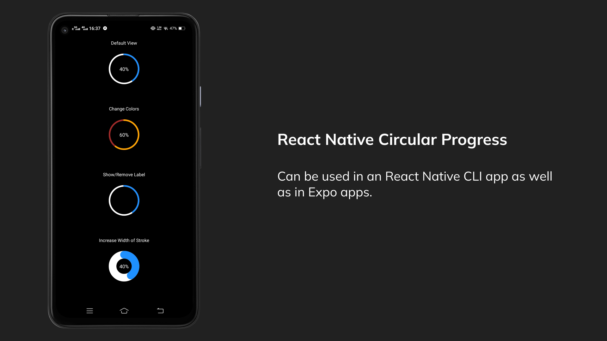

# React Native Circular Progress

This is a simple example of a circular progress bar.
You can use it in both React Native CLI apps as well as in Expo apps.

I've not yet published it on NPM. You can use the [`CircularProgress.tsx`](https://github.com/kartikeyvaish/react-native-circular-progress/blob/main/CircularProgress.tsx) file in the repo locally.

Expo Snack [Link](https://snack.expo.dev/@kartikeyvaish/react-native-circular-progress) to play around

## App Previews



## Usage

1. Simple progress component with default values.

```typescript
<CircularProgress progress={40} />
```

2. You can change colors of the progress

```typescript
<CircularProgress progress={60} outerCircleColor="brown" progressCircleColor="orange" />
```

3. You can show or remove the percentage label

```typescript
<CircularProgress progress={40} showLabel={false} />
```

4. Change stroke width of progress bar

```typescript
<CircularProgress progress={40} strokeWidth={20} />
```

## Parameters

| Parameter           | required | Default       | Description                                         |
| ------------------- | -------- | ------------- | --------------------------------------------------- |
| progress            | YES      | 0             | progress value should be a number between 0 and 100 |
| size                | NO       | 80            | size of the progress component                      |
| showLabel           | NO       | true          | show or hide the percentage label                   |
| strokeWidth         | NO       | 5% of `size`  | stroke width of the progress bar                    |
| outerCircleColor    | NO       | white         | color of the outer circle                           |
| progressCircleColor | NO       | dodgerblue    | color of the progress circle                        |
| labelColor          | NO       | white         | color of the percentage label                       |
| labelStyle          | NO       |               | style of the percentage label                       |
| labelSize           | NO       | 20% of `size` | size of the percentage label                        |
